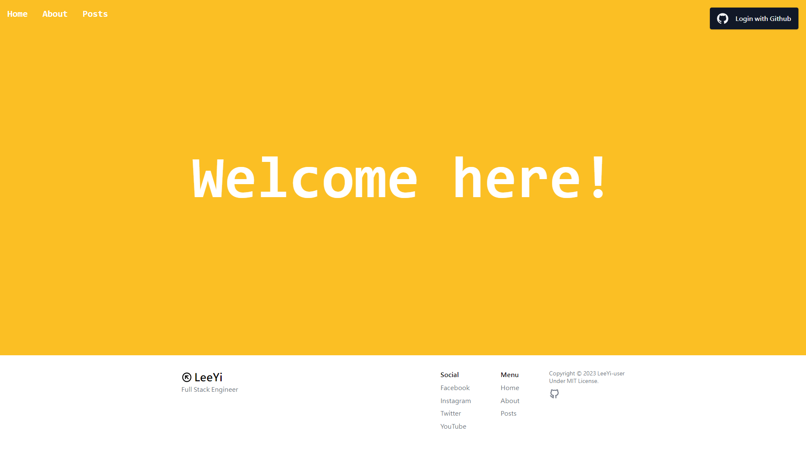

## `Blog`

A minimal personal blog template. It uses [Fresh](https://fresh.deno.dev) +
[MongoDB](https://www.mongodb.com/) + [twind](https://twind.dev)
on Deno Deploy.

To get started, setup your `.env` with MongoDB and Github OAuth credentials:

- `cp .env.example .env`

To setup a
[Github OAuth App](https://developer.github.com/apps/building-oauth-apps/authorizing-oauth-apps)

- Go to https://github.com/settings/applications/new
- Set `Application name` to `Blog Example`
- Set `Homepage URL` to your Deno Deploy project URL. (eg:
  `blog-example.deno.dev`)
- Set `Authorization callback URL` to `http://blog-example.deno.dev` or
  localhost for development.
- Add `Client ID` and `Client Secret` in the `.env` file.

Create a MongoDB project

- Go to cloud.mongodb.com
- Click on "Build a Database".
- Enter cluster details and wait for the database to launch.
- Grab the URL and username and password from and add them to the `.env` file.

and fire up the server:

```
deno task start
```
